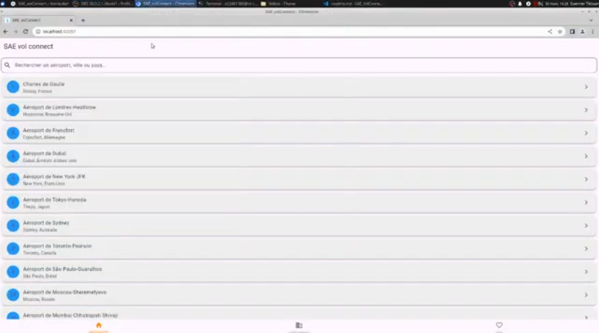
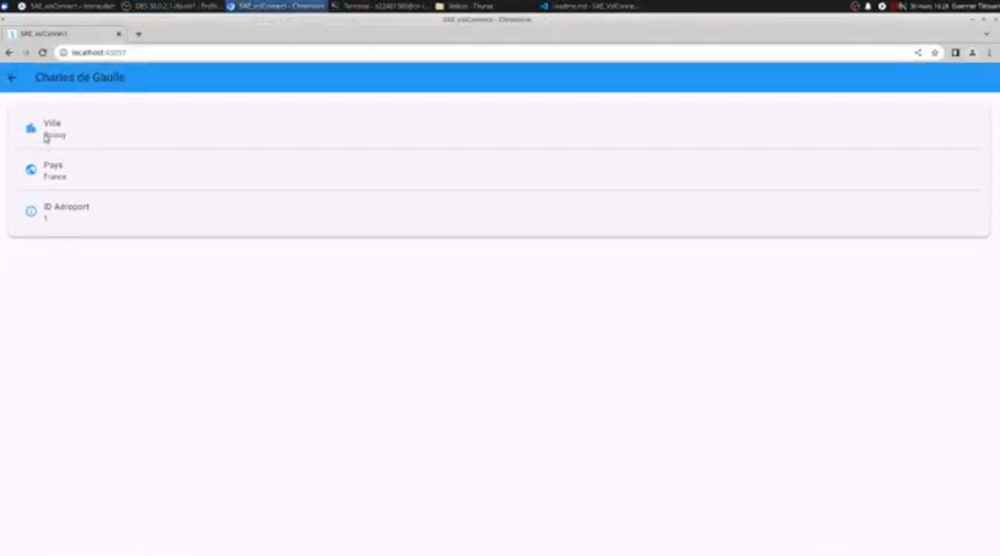
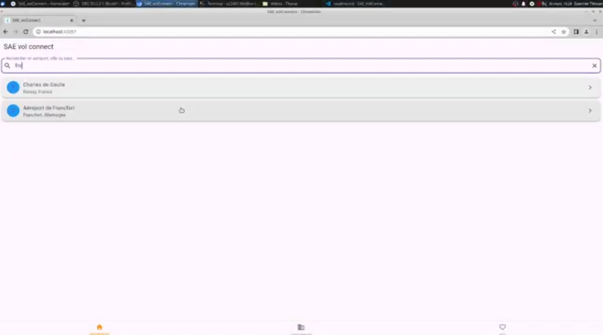
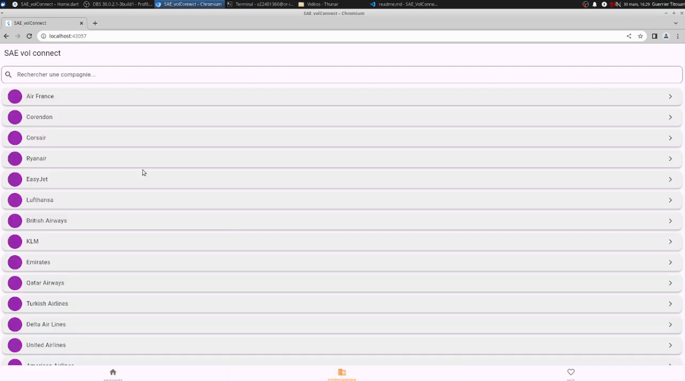
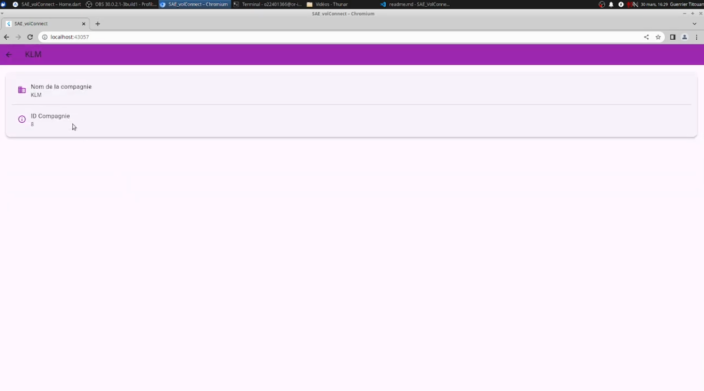
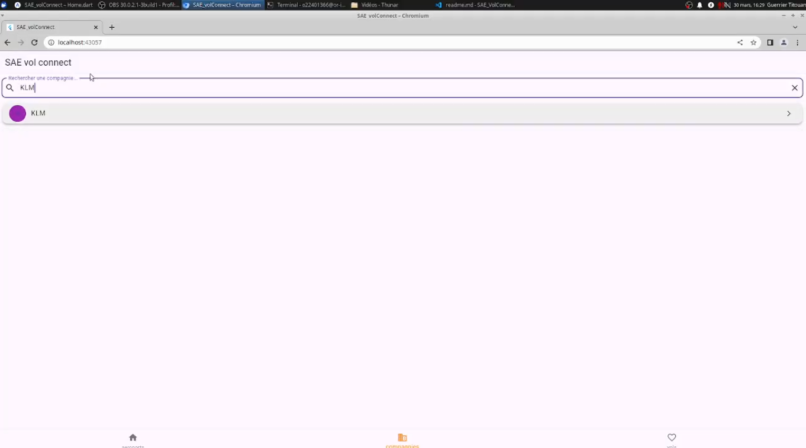
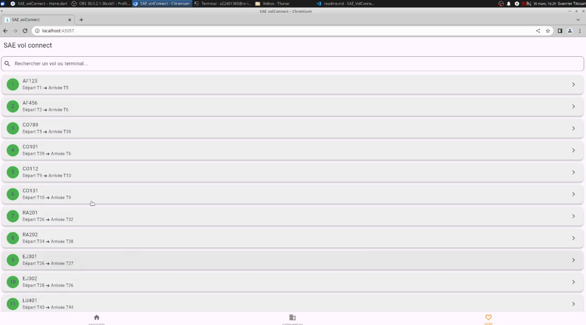
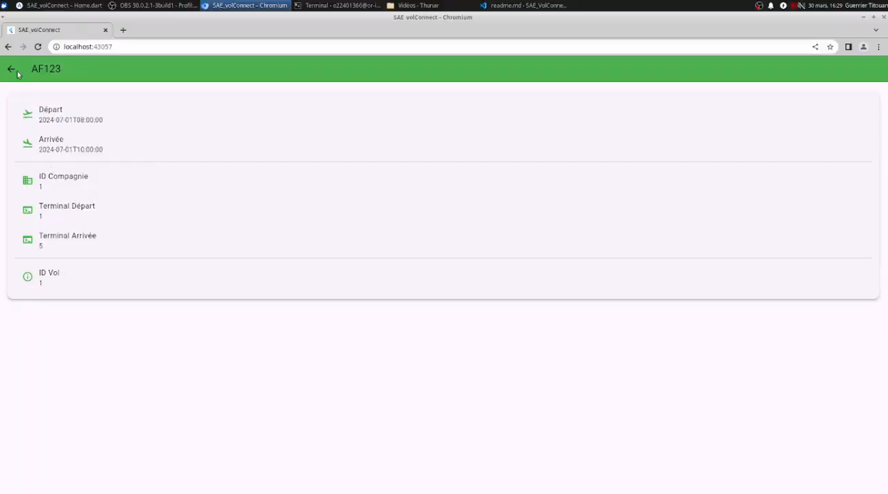
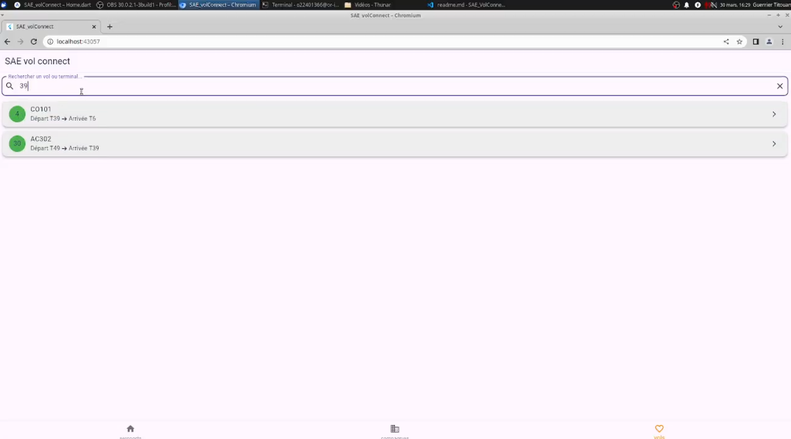

# Manuel d'utilisateur

**Réaliser par :** LACROIX Wyatt, PUPP--BAUDSON Gwendan, GUERRIER Titouan

**Formation :** BUT 2 Informatique

**Établissemment :** IUT d'Orléans

---

Ce document est un manuel utilisateur pour l'application mobile et le site web de la SAE Vol_Connect

## Site Web

Lorsque vous aller lancer le site web (se référer au readme) vous aller arriver sur le dashboard, selon notre BDD vous n'aller rien voir, c'est normal.

### Aéroport

dans la catégorie Aeroport, vous aller pouvoir consulter tous les aéroports existants, ou en créer un en bas de page.

Renseignez les champs et validez.

En cliquant sur un aéroport, vous allez être redirigé sur sa page de détails, vous y verrez ses informations, ainsi que les compagnies qui y sont localisées.

Vous pouvez cliquez sur les compagnies affichées et cela vous redirigera sur la page de détails de la compagnies, on y reviendra plus tard.

Si vous faites des changements n'oubliez pas de valider, et vous pourrez retourner sur la liste des aéroport avec le bouton "Retour à la liste".

### Terminaux

Sur la page des terminaux, le principe est le même, mais cette fois-ci dans les champs à rentrer pour en créer un nouveau, il faut sélectionner l'aéroport, pour cela, cliquer sur le champs qui contient normalement par défaut "Charles de Gaulle". Vous pouvez sélectionner l'aéroport de votre choix.

La modification marche de la même façon.

### Compagnies

Revenons aux compagnies. Encore une fois, même principe que précédemment. Ce qui change va maintenant c'est le contenu de la page détails. Cliquer sur une compagnie de votre choix, vous allez voir en plus du nom de celle-ci, une liste d'aéroports, vous pouvez décider de localiser une compagnie dans zéro ou plusieurs aéroport, en cochant les cases. Validez, aller voir les aéroports que vous avez sélectionné / déselectionner, vous verrez que la compagnie est apparue / a disparue.

### Vols

Pour les vols, c'est un peu plus complexe pour la création, vous allez devoir donner un nom, qui dois respecter le format AB (abreviation du nom de la compagnie) + numéro de vol. Après ça, sélectionner la compagnie correspondante, un terminal de départ et un terminal d'arrivée. Pour finir vous rentrerez les dates et heures de départ et d'arrivée.

### Conclusion

Vous avez maintenant connaissance de toutes les informations nécessaires pour utiliser correctement le site web, bon voyage !

## Application Mobile

### Aéroport

dans la catégorie Aéroport, vous allez pouvoir consulter tous les aéroports existants.

En cliquant sur un aéroport, vous allez être redirigé sur sa page de détails, vous y verrez ses informations.

Vous pouvez rechercher des aéroports selon leurs noms, les villes/pays où ils sont situés.

### Compagnies

Dans la partie compagnies vous pourrez voir les compagnies existantes.

en cliquant sur une compagnie, vous observerez alors toutes ses informations (nom et son identifiant).

Les compagnies sont filtrables seulement selon leur nom et on peut accéder à leurs détails 

### Vols

Sur la page vol vous pourrez accéder à la liste de tous les vols.

La page de détails est accessible en cliquant sur la carte du vol. Il y a la date d'arrivée, de départ, l'id du vol, de la compagnie et les terminaux.

Les vols sont filtrables sur leurs noms et sur le numéro de terminal, il ne faut pas rajouter le T présent dans la page principal.

